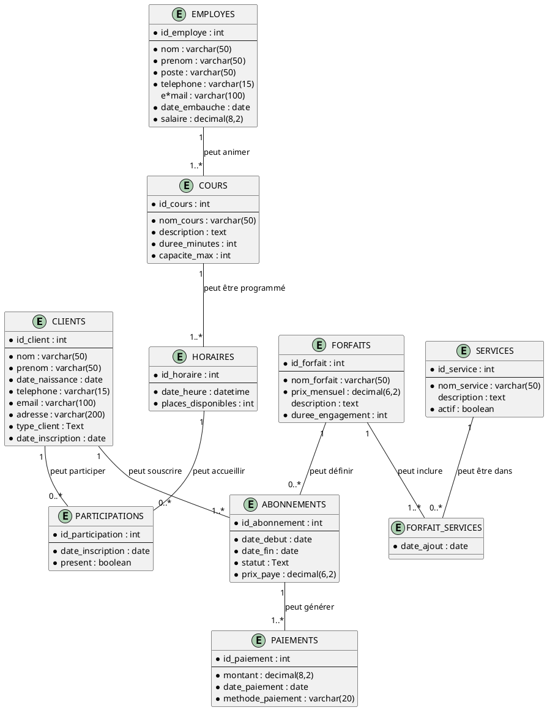
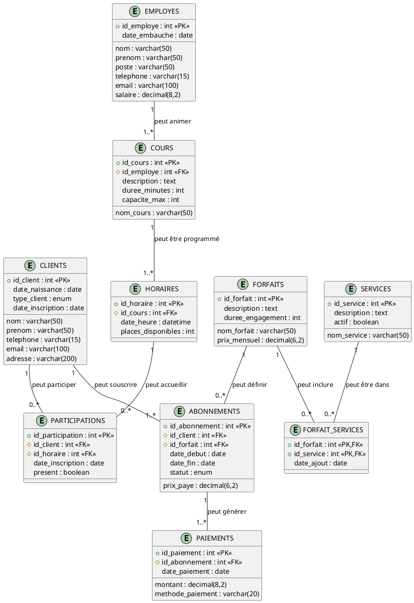

## Modèle logique

### Diagramme entité-association (DEA)

```plantuml
@startuml

entity CLIENTS {
  *id_client : int
---
  *nom : varchar(50)
  *prenom : varchar(50)
  *date_naissance : date
  *telephone : varchar(15)
  *email : varchar(100)
  *adresse : varchar(200)
  *type_client : Text
  *date_inscription : date
}

entity FORFAITS {
  *id_forfait : int
---
  *nom_forfait : varchar(50)
  *prix_mensuel : decimal(6,2)
  description : text
  *duree_engagement : int
}

entity SERVICES {
  *id_service : int
---
  *nom_service : varchar(50)
  description : text
  *actif : boolean
}

entity ABONNEMENTS {
  *id_abonnement : int
---
  *date_debut : date
  *date_fin : date
  *statut : Text
  *prix_paye : decimal(6,2)
}

 entity  EMPLOYES {
  *id_employe : int
---
  *nom : varchar(50)
  *prenom : varchar(50)
  *poste : varchar(50)
  *telephone : varchar(15)
  e*mail : varchar(100)
  *date_embauche : date
  *salaire : decimal(8,2)
}

entity COURS {
  *id_cours : int
---
  *nom_cours : varchar(50)
  *description : text
  *duree_minutes : int
  *capacite_max : int
}

entity HORAIRES {
  *id_horaire : int
---
  *date_heure : datetime
  *places_disponibles : int
}

entity PARTICIPATIONS {
  *id_participation : int
---
  *date_inscription : date
  *present : boolean
}

entity PAIEMENTS {
  *id_paiement : int
---
  *montant : decimal(8,2)
  *date_paiement : date
  *methode_paiement : varchar(20)
}

entity FORFAIT_SERVICES {
  *date_ajout : date
}

CLIENTS "1" -- "1..*" ABONNEMENTS : peut souscrire
FORFAITS "1" -- "0..*" ABONNEMENTS : peut définir

FORFAITS "1" -- "1..*" FORFAIT_SERVICES : peut inclure
SERVICES "1" -- "0..*" FORFAIT_SERVICES : peut être dans

ABONNEMENTS "1" -- "1..*" PAIEMENTS : peut générer

EMPLOYES "1" -- "1..*" COURS : peut animer
COURS "1" -- "1..*" HORAIRES : peut être programmé

CLIENTS "1" -- "0..*" PARTICIPATIONS : peut participer
HORAIRES "1" -- "0..*" PARTICIPATIONS : peut accueillir

@enduml
```
## Modèle physique

```plantuml

@startuml

entity CLIENTS {
 + id_client : int <<PK>>
  nom : varchar(50)
  prenom : varchar(50)
  date_naissance : date
  telephone : varchar(15)
  email : varchar(100)
  adresse : varchar(200)
  type_client : enum
  date_inscription : date
}

entity FORFAITS {
 + id_forfait : int <<PK>>
  nom_forfait : varchar(50)
  prix_mensuel : decimal(6,2)
  description : text
  duree_engagement : int
}

entity SERVICES {
  + id_service : int <<PK>>
  nom_service : varchar(50)
  description : text
  actif : boolean
}

entity ABONNEMENTS {
 + id_abonnement : int <<PK>>
  # id_client : int <<FK>>
  # id_forfait : int <<FK>>
  date_debut : date
  date_fin : date
  statut : enum
  prix_paye : decimal(6,2)
}

 entity  EMPLOYES {
  + id_employe : int <<PK>>
  nom : varchar(50)
  prenom : varchar(50)
  poste : varchar(50)
  telephone : varchar(15)
  email : varchar(100)
  date_embauche : date
  salaire : decimal(8,2)
}

entity COURS {
 + id_cours : int <<PK>>
  # id_employe : int <<FK>>
  nom_cours : varchar(50)
  description : text
  duree_minutes : int
  capacite_max : int
}

entity HORAIRES {
 + id_horaire : int <<PK>>
  # id_cours : int <<FK>>
  date_heure : datetime
  places_disponibles : int
}

entity PARTICIPATIONS {
  + id_participation : int <<PK>>
  # id_client : int <<FK>>
  # id_horaire : int <<FK>>
  date_inscription : date
  present : boolean
}

entity PAIEMENTS {
  + id_paiement : int <<PK>>
  # id_abonnement : int <<FK>>
  montant : decimal(8,2)
  date_paiement : date
  methode_paiement : varchar(20)
}

entity FORFAIT_SERVICES {
 + id_forfait : int <<PK,FK>>
  + id_service : int <<PK,FK>>
  date_ajout : date
}

CLIENTS "1" -- "1..*" ABONNEMENTS : peut souscrire
FORFAITS "1" -- "0..*" ABONNEMENTS : peut définir

FORFAITS "1" -- "0..*" FORFAIT_SERVICES : peut inclure
SERVICES "1" -- "0..*" FORFAIT_SERVICES : peut être dans

ABONNEMENTS "1" -- "1..*" PAIEMENTS : peut générer

EMPLOYES "1" -- "1..*" COURS : peut animer
COURS "1" -- "1..*" HORAIRES : peut être programmé

CLIENTS "1" -- "0..*" PARTICIPATIONS : peut participer
HORAIRES "1" -- "0..*" PARTICIPATIONS : peut accueillir


@enduml
```
