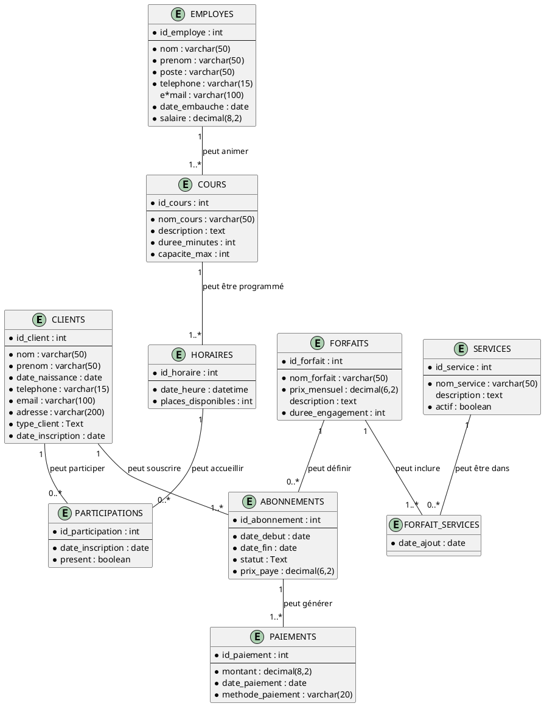
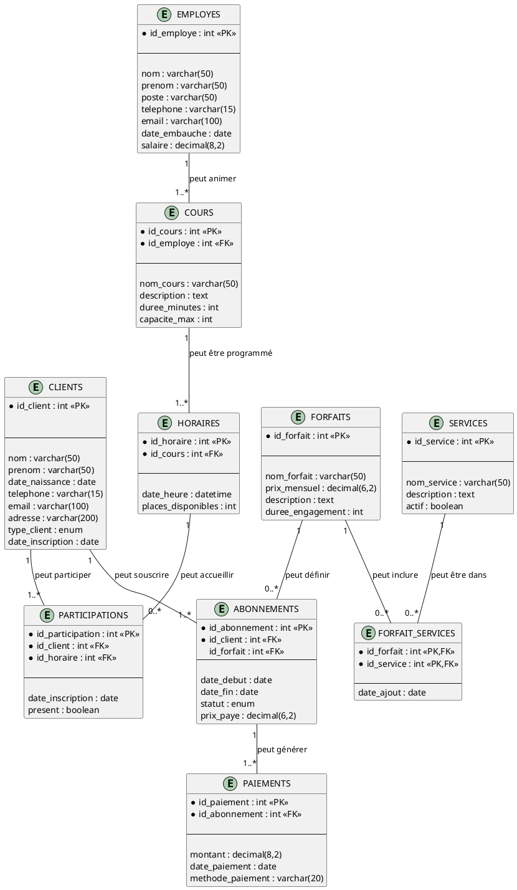

# club-sportif--2302187 Gym Proactif Drummondville

## 1. Description générale

Ce projet consiste en la conception et l'implémentation d'une base de données relationnelle pour la gestion complète du Gym Proactif de Drummondville https://www.gymproactif.com/. Le système vise à moderniser et optimiser la gestion des opérations quotidiennes de ce centre de conditionnement physique.

L'objectif principal est de créer une solution informatique intégrée permettant de gérer efficacement tous les aspects de l'entreprise, depuis l'inscription des membres jusqu'au suivi financier, en passant par la programmation des cours et le management du personnel.

### Principales fonctionnalités à supporter

Le système de base de données doit supporter les fonctionnalités suivantes :

**Gestion des membres :**
- Inscription et profil des clients (informations personnelles, type de clientèle)
- Gestion des différents types de membres (étudiants, réguliers, familles)
- Historique complet des adhésions

**Gestion des forfaits et services :**
- Catalogue des forfaits disponibles avec tarification (basé sur les vrais tarifs du gym)
- Gestion flexible des services inclus dans chaque forfait
- Évolutivité pour l'ajout de nouveaux services

**Système d'abonnements :**
- Souscription des clients aux différents forfaits
- Suivi des périodes d'engagement et des statuts d'abonnement
- Gestion des renouvellements et changements de forfait

**Gestion des cours et activités :**
- Programmation des cours avec instructeurs assignés
- Planification des horaires et gestion des capacités
- Suivi des inscriptions et de la présence des membres

**Suivi financier :**
- Enregistrement de tous les paiements avec méthodes de paiement
- Traçabilité complète des transactions
- Rapports de revenus par forfait et période

**Gestion du personnel :**
- Base de données des employés avec leurs spécialisations
- Attribution des cours aux instructeurs qualifiés

### Identification des principales entités

Le système s'articule autour de **dix entités principales** interconnectées :

**Entités de base :**
- **CLIENTS** : Les membres du gym avec leurs informations personnelles
- **FORFAITS** : Les types d'abonnements proposés (Découverte, Évolution, Jeune Énergie, Famille, Corporatif)
- **SERVICES** : Les prestations et avantages offerts (équipement, sauna, Wi-Fi, cours, accès 24/7)
- **EMPLOYES** : Le personnel du gym (entraîneurs, réceptionnistes, responsables)

**Entités de gestion :**
- **ABONNEMENTS** : Lien entre clients et forfaits avec données contractuelles
- **COURS** : Types d'activités proposées (yoga, musculation, HIIT, pilates)
- **HORAIRES** : Sessions programmées des cours avec disponibilités
- **PARTICIPATIONS** : Inscriptions des membres aux sessions de cours
- **PAIEMENTS** : Transactions financières et historique des paiements

**Entité d'association :**
- **FORFAIT_SERVICES** : Table d'association définissant quels services sont inclus dans chaque forfait

### Associations principales

Le modèle présente plusieurs types de relations :
- **Un-à-plusieurs** : Un client peut avoir plusieurs abonnements, un employé peut animer plusieurs cours
- **Plusieurs-à-plusieurs** : Les forfaits incluent plusieurs services, les clients participent à plusieurs cours
- **Hiérarchiques** : Employés → Cours → Horaires → Participations

## 2. Modèle logique

### Diagramme entité-association (DEA)

### Description des entités

**CLIENTS** : Représente les membres du gym avec leurs informations personnelles et le type de clientèle (étudiant bénéficiant de tarifs préférentiels, client régulier, ou famille).

**FORFAITS** : Définit les différents types d'abonnements disponibles, basés sur la grille tarifaire réelle du Gym Proactif (Forfait Découverte à 40,97$, Forfait Évolution à 49,58$, etc.).

**SERVICES** : Catalogue des prestations et avantages offerts (accès aux équipements, vestiaires et sauna, Wi-Fi gratuit, rabais partenaires, accès 24/7, cours de groupe, programmes personnalisés).

**ABONNEMENTS** : Table centrale qui établit la relation contractuelle entre un client et un forfait, incluant les dates de validité et le montant effectivement payé.

**EMPLOYES** : Personnel du gym incluant les entraîneurs personnels, instructeurs de cours collectifs, personnel d'accueil et responsables.

**COURS** : Types d'activités proposées par le gym (yoga matinal, musculation débutant/avancé, pilates, HIIT cardio, etc.).

**HORAIRES** : Sessions spécifiques programmées pour chaque type de cours, avec gestion des places disponibles.

**PARTICIPATIONS** : Enregistre les inscriptions des membres aux sessions de cours avec suivi de présence.

**PAIEMENTS** : Historique complet des transactions financières avec traçabilité des méthodes de paiement.

**FORFAIT_SERVICES** : Table d'association permettant la gestion flexible des services inclus dans chaque forfait.

### Associations et cardinalités

- **CLIENTS - ABONNEMENTS** (1:1..*) : Un client peut souscrire plusieurs abonnements (historique et renouvellements)
- **FORFAITS - ABONNEMENTS** (1:0..*) : Un forfait peut ne pas avoir d'abonnés ou en avoir plusieurs
- **FORFAITS - FORFAIT_SERVICES** (1:1..*) : Un forfait doit inclure au moins un service
- **SERVICES - FORFAIT_SERVICES** (1:0..*) : Un service peut être temporairement non utilisé
- **ABONNEMENTS - PAIEMENTS** (1:1..*) : Chaque abonnement génère au moins un paiement
- **EMPLOYES - COURS** (1:1..*) : Un employé peut animer plusieurs types de cours
- **COURS - HORAIRES** (1:1..*) : Un cours doit avoir au moins une session programmée
- **CLIENTS - PARTICIPATIONS** (1:1..*) : Un client peut participer à un cours ou à plusieurs
- **HORAIRES - PARTICIPATIONS** (1:0..*) : Une session peut n'avoir aucun participant

## 3. Modèle physique

### Diagramme avec clés primaires et étrangères

## Modèle physique

